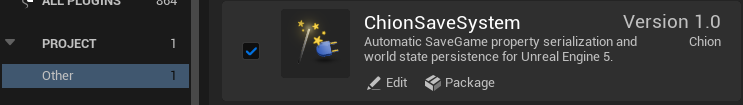
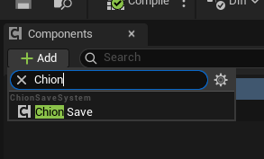
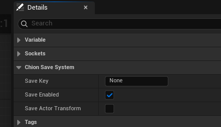
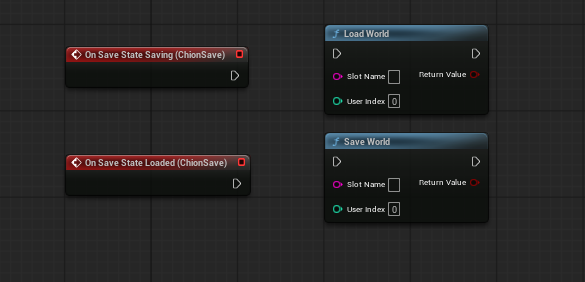
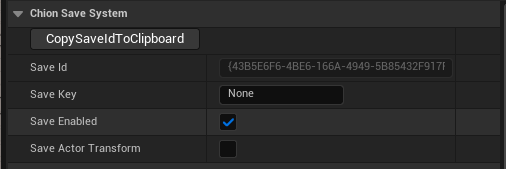
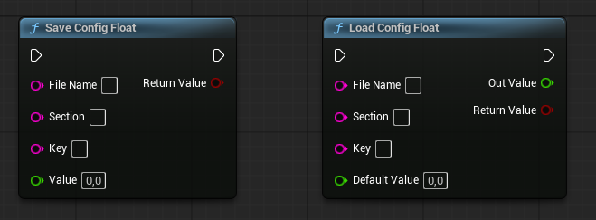
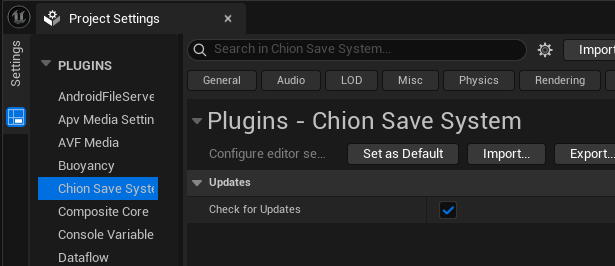
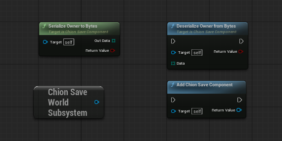

# ChionSaveSystem

A lightweight, Blueprint-friendly save system for Unreal Engine 5 that automatically serializes variables marked with Unreal Engine's `SaveGame` flag.

ChionSaveSystem is designed for Blueprint projects that need persistent Actor state without writing custom save/load logic for every variable.

## Features

- Automatic serialization of Blueprint variables marked with `SaveGame`
- Persistent GUIDs for placed level Actors
- Optional `SaveKey` support for stable logical Actors such as the Player
- Optional Actor Transform save and restore
- Persistent destroyed Actor state
- Restores destroyed Actors when loading an older save during the same game session
- Blueprint events before saving and after loading
- Duplicate `SaveKey` detection
- Blueprint-only game projects supported
- No project-side C++ code required
- Generic INI-based float configuration save/load
- Optional editor-only update checks through GitHub Releases

## Compatibility

Currently tested with:

- Unreal Engine 5.8
- Windows 64-bit
- Blueprint-only projects
- Unreal Engine 5.8 source builds
- Epic Games Launcher build of Unreal Engine 5.8

## Installation

### Source version

Copy the `ChionSaveSystem` folder into your project's `Plugins` directory.

Example:

    YourProject/
    └── Plugins/
        └── ChionSaveSystem/

Restart Unreal Engine and enable **ChionSaveSystem** if necessary.

### Precompiled UE 5.8 version

A precompiled Windows build for the Epic Games Launcher version of Unreal Engine 5.8 is available in the GitHub Releases section.

## Basic Usage

### 1. Add the Save Component

Add a **Chion Save Component** to any Actor that should participate in the save system.

### 2. Configure the Component

The component provides a few simple options:

- **Save Key** — optional stable identifier for Actors such as the Player
- **Save Enabled** — enables or disables saving for this Actor
- **Save Actor Transform** — saves and restores the Actor's position, rotation, and scale

### 3. Mark variables for saving

Select each Blueprint variable you want to persist and enable the Unreal Engine **SaveGame** flag.

Variables without the `SaveGame` flag are ignored.

### 4. Save and Load

Use the Blueprint nodes **Save World** and **Load World**.

Provide the same Slot Name and User Index when saving and loading.

The component also exposes the events **On Save State Saving** and **On Save State Loaded**.

## Persistent Save ID

Placed level Actors automatically receive a persistent `SaveId` (GUID).

This GUID is used to identify the same Actor across save and load operations, including after restarting the editor or reloading the level.

The Save ID remains stable for the Actor instance. Duplicated Actors receive their own new Save ID.

The **CopySaveIdToClipboard** button can be used to copy the GUID for debugging or verification.

## Save Keys

Placed level Actors normally use their automatically generated persistent GUID.

For Actors that should use a stable logical identifier instead, such as the Player, set a unique Save Key, for example:

    Player

Save Keys must be unique.

Duplicate Save Keys are detected and will not be saved or loaded.

## Actor Transform

Enable **Save Actor Transform** on the Chion Save Component if the Actor's position, rotation, and scale should also be persisted.

## Destroyed Actors

GUID-based level Actors destroyed during gameplay are tracked by the save system.

If the game is saved after an Actor was destroyed, loading that save removes the Actor again.

If an older save is loaded while that Actor is currently destroyed, ChionSaveSystem recreates the Actor from its saved class and spawn transform, restores its original Save ID, and then restores its saved state.

This allows save states to correctly move both forward and backward within the same game session.

## Blueprint Events

### On Save State Saving

Called immediately before the Actor is serialized.

This can be used to copy runtime state from components into variables marked with `SaveGame`.

### On Save State Loaded

Called after the Actor state has been restored.

This can be used to update components, visuals, animations, or other runtime state after loading.

## Config Values

Starting with **v1.1.0**, ChionSaveSystem provides simple Blueprint nodes for storing float values in custom INI files.

Available nodes:

- `Save Config Float`
- `Load Config Float`

Example:

    File Name: SoundSettings
    Section: Audio
    Key: Music
    Value: 0.75

This creates or updates:

    Project/Saved/Config/SoundSettings.ini

with content similar to:

    [Audio]
    Music=0.750000

`Load Config Float` also supports a default value that is returned when the file, section, or key does not exist.

These config nodes are independent from `Save World` / `Load World` and are useful for persistent global settings such as audio, gameplay, or UI preferences.

## Optional Update Checks

Starting with **v1.2.0**, ChionSaveSystem includes an editor-only update checker.

It can be enabled under:

    Project Settings
    → Plugins
    → Chion Save System
    → Check for Updates

When enabled, the plugin checks the GitHub Releases API once when the Unreal Editor starts.

If a newer release is available, a notification appears in the editor with a direct **Open Release Page** link.

The update checker:

- is disabled by default
- runs only in the Unreal Editor
- does not run in packaged games
- does not download or install updates automatically
- does not transmit project data or telemetry
- only requests the latest release information from the public GitHub Releases API

## Module Structure

ChionSaveSystem contains two Unreal Engine modules:

- `ChionSaveSystem` — Runtime module containing save/load and config functionality
- `ChionSaveSystemEditor` — Editor-only module containing update settings, GitHub release checks, and editor notifications

The editor module is not loaded in packaged games.

## Advanced Blueprint Nodes

ChionSaveSystem also exposes lower-level Blueprint functionality:

- `Serialize Owner to Bytes`
- `Deserialize Owner from Bytes`
- `Chion Save World Subsystem`
- `Add Chion Save Component`

These nodes are not required for normal Save/Load usage.

## Current Scope

The current release focuses on placed level Actors using persistent GUIDs, stable logical Actors using Save Keys, Blueprint variables marked with `SaveGame`, persistent destroyed Actor state, optional Actor Transform persistence, generic float config persistence, and optional editor-only update notifications.

General-purpose persistence for arbitrary runtime-spawned Actors, such as dropped inventory items that must survive across game restarts, is not part of this release.

## License

ChionSaveSystem is released under the MIT License.

See [LICENSE](LICENSE) for details.
